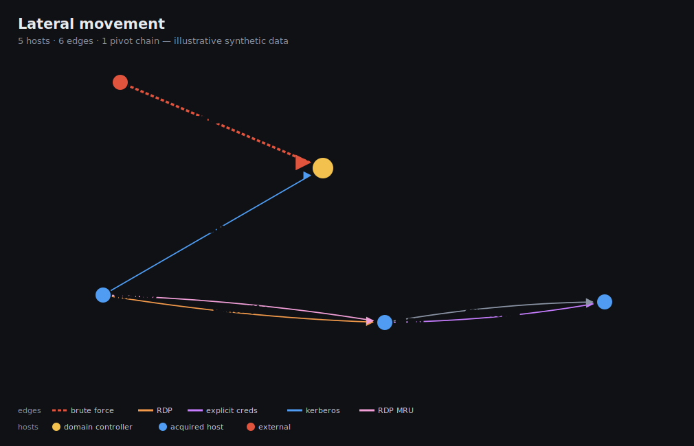

<p align="center">
  
</p>

<h1 align="center">Artifact Engine</h1>

<p align="center"><i>DFIR triage &#183; parse &#183; detect &#183; connect</i></p>

<p align="center">
  <a href="LICENSE"></a>
  <a href="pyproject.toml"></a>
  
  
</p>

Modular DFIR triage engine. It extracts workstation/server acquisitions
(**KAPE** and **Velociraptor live response** on Windows, **UAC** on Linux — plus
loose web-server / FortiGate log drops), detects the system type, runs **92
forensic parsers** in parallel and consolidates the results into a `.db`
(SQLite) and a `.xlsx` (Excel) per machine for review, with a detection layer
(YARA, Sigma, Chainsaw/Hayabusa, LOLBAS/LOLDrivers/RMM, persistence scans) and a
cross-machine lateral-movement graph on top.

Successor to CyberCrusader, redesigned to be **fast, parallel and easy to
extend**: parsing tools are declared in **YAML**, not in code.

See [ARCHITECTURE.md](docs/ARCHITECTURE.md) for the internals (pipeline stages,
module layout, how detections and the lateral-movement graph are built).

<p align="center">
  
  <br>
  <sub>Cross-machine lateral-movement graph (<code>lateral_movement.html</code>) — who authenticated
  where, with pivot chains highlighted. Illustrative synthetic data.</sub>
</p>

## Contents

- [Pipeline](#pipeline)
- [Installation](#installation-development)
- [Usage](#usage)
- [Configuration](#configuration)
- [How to add a parsing tool](#how-to-add-a-parsing-tool)
- [Detections](#detections)
- [Example outputs](#example-outputs)
- [Output layout](#output-layout)

## Pipeline

```
parent folder with .zip / .tar.gz
   |
   v
[0] Integrity   -> traces.txt + traces.csv  (SHA256 of the originals, BEFORE touching anything)
[1] Extraction  -> recursive (tar.gz in one pass, nested, anti zip-bomb) + containers inside loose drops
[2] Detection   -> profile/OS per machine (profiles/*.yaml)
[3] Parsing     -> parsers (parsers/*.yaml) in parallel, respecting dependencies
[4] Consolidation -> <machine>.db + <machine>.xlsx + report.txt (informative sheet)
[5] Lateral movement -> lateral_movement.csv + .html (cross-machine logon graph)
```

## Installation (development)

```sh
pip install -e ".[dev]"
aeng setup            # downloads binaries + offline assets, prepares the config
```

`setup` fetches the external tools (EZ Tools, chainsaw, hayabusa, SIDR, …) and
the offline enrichment assets: db-ip country/ASN databases + the Tor exit list
(IP origin columns) and the YARA signature-base ruleset. Everything is
best-effort — a missing asset degrades gracefully (e.g. country shows `?`).

If the `aeng` script is not on PATH, use `python -m artifact_engine` instead.

### Windows right-click integration

Double-click **`INSTALL.bat`** to add a *"Process with Artifact Engine"* entry
to the folder right-click menu (registered for the current user, **no admin
required**). Right-click the parent folder holding the acquisitions and pick it
to run `aeng run -p "<that folder>"` in a console that stays open.

On **Windows 11** the entry lives under **"Show more options"** (Shift+F10), as
do all registry-based context-menu verbs. Run **`UNINSTALL.bat`** to remove it.
Equivalent commands: `aeng install-menu` / `aeng uninstall-menu`.

## Usage

```sh
aeng run -p "C:\path\to\the\evidence"     # parent folder with the .zip / .tar.gz
aeng lateral -p "C:\path\to\the\evidence" # rebuild only the lateral-movement graph
aeng list-parsers
aeng list-profiles
```

Options: `--force` re-parses even if output already exists; `-v` is verbose.

### Loose log drops (no acquisition needed)

Logs that arrive on their own (a hosting export, a firewall export) can be
dropped in a folder named **`<kind>`** or **`<kind>-<label>`** at the case root;
each folder becomes its own machine with its own `.db`/`.xlsx`:

```
C:\Cases\my-case\
  uac-server1-...\              <- normal acquisition
  weblogs-www.client.com\       <- Apache/nginx access logs (any file names,
    EXPORT_2026.zip                 rotations and zipped exports included)
  fortigate-fw-edge\            <- FortiGate/FortiOS key=value logs
```

`weblogs` runs the full web timeline, the attack hunt and the SigmaHQ web
ruleset; `fortigate` builds one flagged traffic/event timeline.

## Configuration

`aeng setup` writes a `config.yaml` in the working folder. All keys are optional:

| Key | Default | Effect |
|-----|---------|--------|
| `max_workers` | CPU count | Parallel workers (parsing and consolidation). |
| `avoid_vss` | `true` | `false` also parses each VSS snapshot as an extra volume (slower). |
| `emit_db` | `true` | Build the queryable SQLite `.db` per machine. |
| `emit_xlsx` | `true` | Build the Excel `.xlsx` per machine. **`false` is much faster** — the `.xlsx` pass dominates consolidation. |
| `parse_processes` | `true` | Use a process pool for CPU-bound work (parsing handlers, and consolidation across machines). `false` = threads only (lower peak RAM). |
| `extract_depth` | `3` | Levels of nested archives to unpack (zip inside zip). |
| `traces_include_drops` | `true` | Phase-0 hashes files inside loose-drop folders (`weblogs*`/`fortigate*`) for chain of custody. `false` skips them (delivered root containers are still hashed) — faster when custody of the raw logs isn't required. |

For the fastest run when you only need to query the `.db`, set `emit_xlsx: false`.

## How to add a parsing tool

Create a `parsers/<os>/<id>.yaml`. ~85% of cases are declarative (run a binary).
For custom logic use a Python handler. See the examples under
`src/artifact_engine/data/parsers/`.

A command-based parser (most common):

```yaml
id: my_parser
os: windows
category: execution
requires: ["Windows/prefetch"]
tool:
  binary: PECmd.exe
  source: { url: "https://download.ericzimmermanstools.com/net9/PECmd.zip", unpack: true }
command:
  - "{binary}"
  - "-d"
  - "{evidence}/Windows/prefetch"
  - "--csv"
  - "{out}"
```

A logic-based parser (Python handler):

```yaml
id: my_handler
os: linux
category: shell
handler: "artifact_engine.handlers.my_module:run"
```

## Detections

Beyond parsing, a detection layer surfaces what matters (`CSVs/Detections/` per
machine, most-severe first):

- **Windows**: Chainsaw + Hayabusa (Sigma over event logs), DeepBlueCLI, YARA
  (bundled + signature-base), RMM tools on disk (LOLRMM), vulnerable/malicious
  drivers by hash (LOLDrivers), LOLBAS binaries relocated to staging dirs, and a
  native registry ASEP/persistence scan.
- **Linux**: YARA, Sigma (SigmaHQ Linux ruleset over raw auditd + syslog),
  GTFOBins abuse in shell history, webshell scan of web roots, MDATP state —
  plus `flag` columns across the system-state outputs (SUID/GTFOBins, eBPF pins,
  kernel taint, anti-forensics log checks).
- **Web**: the attack hunt (`huntweb`) flags served exploitation payloads
  (SQLi/LFI/cmdi/webshell/log4shell/XSS) plus whatever you add to
  `assets/web_suspicious.txt` — a plain analyst-editable list (`label = regex`,
  one per line, read every run); `web_sigma` scores the same logs with the
  SigmaHQ webserver ruleset, aggregated per rule + source IP. Public IPs carry
  offline origin columns (country, Tor/hosting/foreign, ASN).
- **Velociraptor live response**: per-row low-FP flags over the volatile state
  (processes, netstat, services, tasks, …) with a derived `suspicious.json` and
  cross-artifact `correlation.json`.

## Example outputs

*(All examples below use synthetic data — hosts, IPs and users are made up;
public IPs use the RFC 5737 documentation ranges.)*

A run over a mixed folder of acquisitions (KAPE + UAC + loose log drops):

```text
$ aeng run -p C:\Cases\breach-2026

[+] Extraction     16/16 archives (nested, anti zip-bomb)          195s
[+] Detection      21 machine(s)  (windows/kape, linux/uac, linux/fortigate, linux/weblogs)
[+] Parsing        974 task(s) | 32 proc + 32 thread
[+] Consolidation  <machine>.db + report.txt per machine            65s
[+] Lateral movement: 3150 edge(s), 1053 host(s), 114 suspicious, 4 pivot chain(s)
                      -> lateral_movement.csv + .html
[+] Done in 910s | 21 machine(s) | OK 737 | skipped 237 | errors 0
```

Every artifact lands as a per-category CSV, then all of them roll up into one
queryable `<machine>.db` (and, optionally, `.xlsx`). A detection CSV, for
example `Detections/web_sigma.csv` — the SigmaHQ web ruleset over access logs,
aggregated per rule + source IP and enriched with offline IP origin:

| level | rule | hits | ip | country | origin | status | sample_uri |
|---|---|--:|---|---|---|--:|---|
| high | SQL Injection Strings In URI | 214 | 198.51.100.23 | RU | hosting | 200 | `/app?id=1 UNION SELECT user,pass FROM users` |
| high | Path Traversal Exploitation Attempts | 61 | 203.0.113.9 | NL | hosting | 200 | `/dl?f=../../../../etc/passwd` |
| high | Webshell ReGeorg | 8 | 203.0.113.9 | NL | hosting | 200 | `/uploads/tunnel.php?cmd=read` |
| medium | Source Code Enumeration (.git/) | 33 | 198.51.100.23 | RU | hosting | 404 | `/.git/config` |

…and the `web` attack-hunt (`huntweb`) or the Velociraptor `suspicious.json`
follow the same shape: the interesting rows first, each with the reason it was
flagged.

## Output layout

Per machine, outputs are grouped by DFIR category under `CSVs/` (Filesystem,
Execution, EventLogs, Registry, SystemInfo, Shell, Browser, Persistence, Search,
Network, Processes, Web, Detections), plus `JSONs/` for Velociraptor live
response. They are then consolidated into `<machine>.db` and `<machine>.xlsx`
(either output can be turned off in `config.yaml`), plus a `report.txt` per
machine.

At the case root you also get `run-summary.{txt,json}` and, when Windows logon
events are present, a cross-machine **`lateral_movement.csv`** (unified logon
timeline) and **`lateral_movement.html`** (self-contained interactive graph of who
authenticated where -- RDP, explicit-credential, failed and inter-host movement
highlighted, plus detected **pivot chains**: user lands on a host and moves on
from it, listed as clickable attack paths). The graph needs no libraries and works
offline: direction arrows, search by user/host, filter by logon category, a
time-range slider with chronological playback, zoom/pan, per-edge username + date
labels, and a chronological timeline sidebar. VSS snapshots are parsed as their
own machines (own folder + `.db`).
